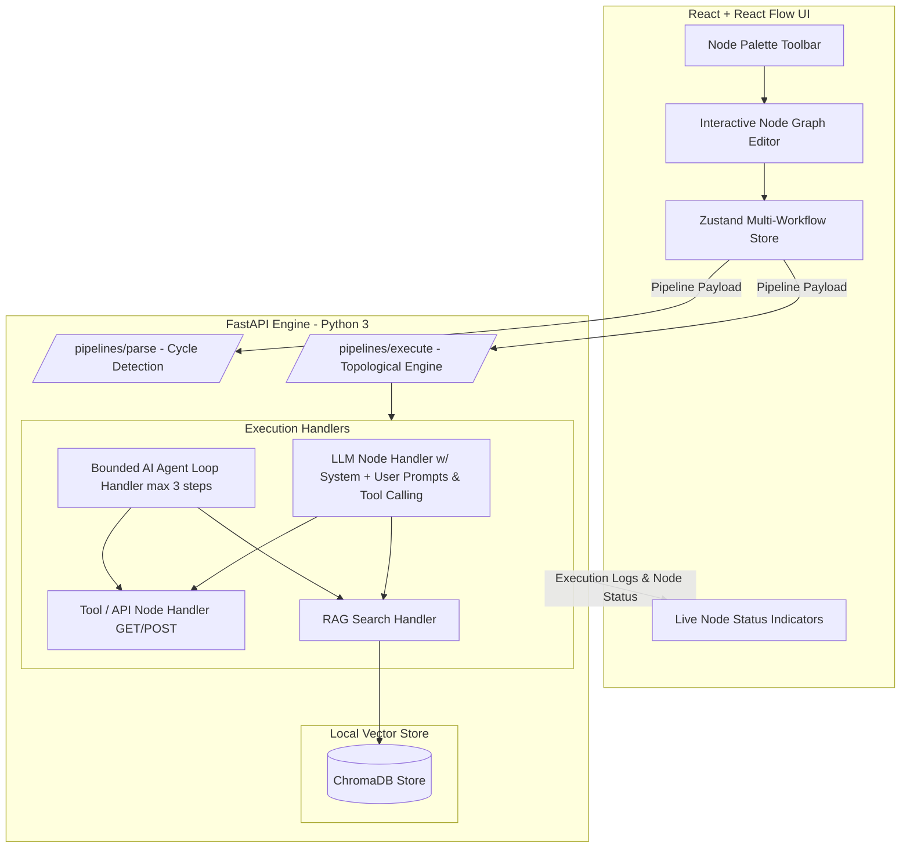

# Workflow Studio - AI Pipeline & Agent Engine

A full-stack, drag-and-drop workflow builder built with **React**, **React Flow**, and **FastAPI**. Users can visually design, validate, and execute complex AI dataflows, REST API integrations, local vector RAG searches (ChromaDB), and autonomous AI agent loops.

---

## AI & Execution Architecture Overview

Workflow Studio has been upgraded with a pure Python execution engine and visual status tracking:



### Key AI Components

1. **Improved LLM Node**:
   - Distinct **System Prompt** and **User Prompt** input fields.
   - Dynamic `{{variable}}` interpolation in user prompt templates.
   - Built-in **Single-Step Tool Calling** mode: prompts the model to pick from callable tools (`api_request`, `rag_search`), executes the chosen tool, and synthesizes a final response.
   - Surface human-readable LLM API errors directly on the node UI.

2. **Tool / API REST Node**:
   - Supports **GET**, **POST**, **PUT**, and **DELETE** HTTP requests.
   - Supports variable interpolation (`{{var}}`) inside URL, query parameters, and request body.
   - Passes JSON/text responses forward as downstream node output.
   - Handles HTTP 4xx/5xx status codes, timeouts, and network connection errors with explicit node warning badges.

3. **Local RAG Pipeline (ChromaDB)**:
   - **Document Node**: Uploads text/PDF files or raw text, splits content into paragraph/fixed-size chunks, generates embeddings, and indexes them into a local **ChromaDB** store with zero paid cloud infrastructure.
   - **RAG Search Node**: Takes search queries (supporting `{{var}}`), queries ChromaDB for the top-k relevant text chunks, and outputs formatted context blocks to pass into LLM prompts.

4. **Bounded AI Agent Node**:
   - Receives an overarching goal/instruction (supporting `{{var}}`).
   - Executes a bounded reasoning loop capped at max 3 steps.
   - Dynamically selects tools (`api_request` and `rag_search`), executes actions, and synthesizes answers.
   - Displays transparent, step-by-step reasoning logs directly in the node card UI.

5. **Visible Execution Status Tracking**:
   - Each node displays live execution status: **Pending (•)**, **Running (⏳)**, **Success (✓)**, or **Error (⚠️)** directly on its card header.
   - Output previews and error banners render directly inside node cards.

---

## Setup & Running Locally

### Prerequisites

- Python 3.8+
- Node.js v14+
- npm or yarn

### Backend Setup

1. Navigate to `backend/`:
   ```bash
   cd backend
   ```

2. Install Python dependencies (FastAPI, uvicorn, pydantic, httpx, chromadb):
   ```bash
   pip install -r requirements.txt
   ```

3. Start the FastAPI development server:
   ```bash
   python -m uvicorn main:app --reload --port 8000
   ```
   The backend runs on `http://127.0.0.1:8000`.

### Frontend Setup

1. Navigate to `frontend/`:
   ```bash
   cd frontend
   ```

2. Install npm packages:
   ```bash
   npm install
   ```

3. Start the React development server:
   ```bash
   npm start
   ```
   The app opens automatically at `http://localhost:3000`.

---

## Worked Example Workflows

### Worked Example 1: `Input -> LLM -> API -> Output`

This workflow takes user lead details, generates a search topic via LLM, fetches external REST API data, and outputs the result.

```
┌──────────────┐     ┌──────────────┐     ┌──────────────┐     ┌──────────────┐
│  Input Node  │ ──> │   LLM Node   │ ──> │   API Node   │ ──> │ Output Node  │
└──────────────┘     └──────────────┘     └──────────────┘     └──────────────┘
```

#### Step-by-Step Graph Setup:
1. **Input Node** (`input-1`):
   - `inputName`: `post_id`
   - `value`: `1`
2. **LLM Node** (`llm-1`):
   - `system`: "You format API query paths."
   - `prompt`: "https://jsonplaceholder.typicode.com/posts/{{post_id}}"
3. **API Node** (`api-1`):
   - `method`: `GET`
   - `url`: `{{prompt}}` (connected from LLM output)
4. **Output Node** (`output-1`):
   - `outputName`: `final_post_data`

#### Execution Data Flow:
- `input-1` passes `"1"` to `llm-1`.
- `llm-1` interpolates `{{post_id}}` to return `"https://jsonplaceholder.typicode.com/posts/1"`.
- `api-1` executes a HTTP GET request to JSONPlaceholder and receives the post JSON object.
- `output-1` displays the resulting JSON object in the execution modal and terminal output.

---

### Worked Example 2: `Document -> RAG -> LLM -> Output`

This workflow indexes a document into local ChromaDB vector store, retrieves relevant context based on a query, and uses an LLM to generate an answer.

```
┌──────────────┐     ┌──────────────┐     ┌──────────────┐     ┌──────────────┐
│ Document Node│ ──> │  RAG Search  │ ──> │   LLM Node   │ ──> │ Output Node  │
└──────────────┘     └──────────────┘     └──────────────┘     └──────────────┘
```

#### Step-by-Step Graph Setup:
1. **Document Node** (`document-1`):
   - `title`: `Return Policy`
   - `text`: `Workflow Studio offers a 30-day full refund policy on all software licenses.`
2. **RAG Search Node** (`ragSearch-1`):
   - `query`: "What is the refund policy?"
   - `top_k`: `1`
3. **LLM Node** (`llm-2`):
   - `system`: "You are a customer support AI."
   - `prompt`: "Based on context: {{context}}, answer the customer."
4. **Output Node** (`output-2`):
   - `outputName`: `support_answer`

#### Execution Data Flow:
- `document-1` chunks and upserts the text into local ChromaDB.
- `ragSearch-1` searches ChromaDB for "refund policy" and returns retrieved chunk: `"[1] (Return Policy): Workflow Studio offers a 30-day full refund policy..."`.
- `llm-2` interpolates `{{context}}` into its user prompt and generates a customer support response.
- `output-2` presents the final support answer.

---

## Available Node Types

### Original & Core Nodes
- **Input** (📥): Entry point for user/workflow input data.
- **Output** (📤): Terminal node presenting final pipeline execution results.
- **Text** (📝): Dynamic template node with real-time `{{variable}}` handle detection and auto-resizing.
- **Math** (🔢): Operates arithmetic functions (add, subtract, multiply, divide, modulo).
- **Filter** (🔍): Conditional filtering (`equals`, `contains`, `greater_than`).
- **Timer** (⏱️): Delay node in seconds.
- **Database** (🗄️): SQL query node simulation.

### Practical AI & Tooling Nodes
- **LLM** (🤖): Dual System/User prompts, prompt variable interpolation, and tool-calling mode.
- **Tool / API** (🌐): Real REST API request executor (GET/POST/PUT/DELETE) with variable injection.
- **Document** (📄): Text/PDF document chunker & local ChromaDB vector indexer.
- **RAG Search** (🔍): Local vector similarity search returning top-k text chunks.
- **AI Agent** (⚡): Bounded goal-driven agent loop with step-by-step reasoning logs.

---

## Testing

### Run Backend Unit Tests
```bash
python backend/test_main.py
```

### Run Frontend Tests
```bash
cd frontend
npm test -- --watchAll=false
```

---

## License

MIT License. Designed for Workflow Studio Technical Assessment.
